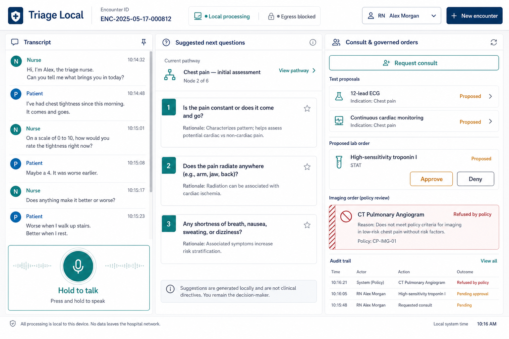
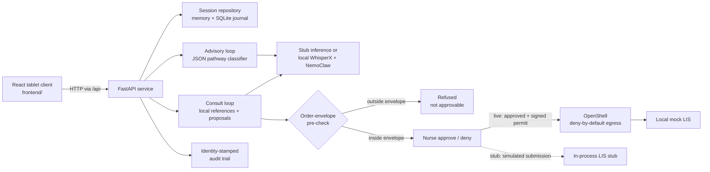

# Triage Local

Local-first emergency-department triage decision support with governed test-order
proposals.

> [!IMPORTANT]
> Triage Local is a hackathon prototype, not a medical device. It does not
> diagnose patients, direct care, or validate clinical correctness. The nurse
> remains the decision-maker for every proposed action.



## Overview

Triage Local keeps a patient encounter on one machine: audio capture,
transcription, pathway classification, local-reference retrieval, proposal
generation, policy evaluation, and audit logging. The demo is designed for a
Dell GB10-class system running local WhisperX and NVIDIA NemoClaw/OpenShell, but
its complete governed workflow can also run on a development machine with
deterministic stub inference.

The project demonstrates two narrow claims:

1. Patient data can be processed locally with deny-by-default network egress.
2. A generated test-order proposal cannot leave the agent unless it is inside a
   declared order envelope and a nurse explicitly approves it.

It deliberately does **not** claim that its suggestions or proposals are
clinically validated.

## Highlights

- **Local-first processing** — transcripts and reasoning stay on the host.
- **Separate advisory and consult loops** — next-question suggestions update
  after each utterance; governed proposals are generated only when a nurse
  requests a consult.
- **Deterministic pathway structure** — a closed-label JSON state machine
  drives the advisory loop instead of using retrieval for pathway navigation.
- **Grounded proposals** — consult results include a rationale and a citation
  to the bundled local reference corpus.
- **Pre-approval policy enforcement** — out-of-envelope test codes are marked
  `refused` before the UI can offer an approval action.
- **Human approval with identity** — every decision carries the selected
  nurse's ID and name.
- **Fail-closed order submission** — an approval mints a short-lived,
  proposal-bound HMAC permit; failed egress remains visibly recorded.
- **Durable audit evidence** — session state and audit entries are journaled to
  SQLite for demo recovery.

## Architecture



The two agent loops share the session transcript but remain separate:

| Loop | Trigger | Output | Governance |
| --- | --- | --- | --- |
| Advisory | Every utterance | Suggested next questions | UI guidance only |
| Consult | Explicit nurse request | Cited test-order proposals | Envelope check, human decision, signed permit, and audited egress |

## Quick start

### Prerequisites

- Python 3.12 or 3.13 (`>=3.12,<3.14`)
- Node.js 22.16 or newer
- npm 10 or newer
- Bash 4.3 or newer for the combined launcher

Clone the repository and start the API and current tablet client:

```bash
git clone https://github.com/Xuefeng-Zhu/Emergency-Triage.git
cd Emergency-Triage
cp .env.example .env
scripts/dev.sh
```

The startup script creates `.venv`, installs the API and frontend dependencies,
and launches:

- Tablet client: <http://localhost:5174>
- API: <http://localhost:8787>
- Interactive API docs: <http://localhost:8787/docs>
- Health check: <http://localhost:8787/healthz>

Stub mode is the default. It loads no reasoning model and exercises the
transcript, pathway, consult, policy refusal, approval, mock order, and audit
flow with deterministic responses. The current client starts in **Type** mode;
enter an utterance, request a consult, then use the arrow controls to review
proposals and the visit note. The **Test data** toggle is a UI-only presentation
fixture and does not exercise the API.

Press `Ctrl+C` to stop both development servers.

> [!NOTE]
> `scripts/dev.sh` uses `wait -n`, which is not available in macOS's bundled
> Bash 3.2. Install a newer Bash or start the API and frontend separately with
> the commands in [Development](#development).
>
> Microphone transcription requires the WhisperX dependencies used by the live
> GB10 setup. Use Type mode for the dependency-light stub workflow.

## Runtime modes

Reasoning and governed egress are selected with `TRIAGE_MODE`:

| Value | Behavior |
| --- | --- |
| `stub` | Deterministic proposals and simulated in-process order submission; no GPU model, sandbox, or network call |
| `live` | NemoClaw reasoning and OpenShell-governed submission to the local mock LIS |

Transcription is selected independently with `TRIAGE_STT_MODE`:

| Value | Behavior |
| --- | --- |
| `stub` | Returns the deterministic canned transcript |
| `echo` | Decodes uploaded UTF-8 text verbatim; testing only |
| `live` | Transcribes uploaded audio with local WhisperX |

When `TRIAGE_STT_MODE` is unset, it inherits `TRIAGE_MODE`. The supported
combinations are:

| `TRIAGE_MODE` | `TRIAGE_STT_MODE` | Use case |
| --- | --- | --- |
| `stub` | unset or `stub` | Deterministic local development; no GPU models |
| `live` | `echo` | Live NemoClaw reasoning and governed egress using typed UTF-8 utterances |
| `live` | `live` or unset | Full local WhisperX transcription and NemoClaw reasoning |

`echo` is a testing adapter, not a production mode. It preserves typed
utterances while exercising every live component after transcription.

The most important environment variables are:

| Variable | Default | Purpose |
| --- | --- | --- |
| `TRIAGE_MODE` | `stub` | Selects stub or live completion and egress |
| `TRIAGE_STT_MODE` | same as `TRIAGE_MODE` | Optionally selects `stub`, `echo`, or live transcription |
| `TRIAGE_DATABASE_PATH` | `./data/triage.sqlite3` | SQLite session journal |
| `TRIAGE_WEB_ORIGIN` | `http://localhost:5173` | Allowed browser origin for direct API calls |
| `TRIAGE_API_URL` | `http://127.0.0.1:8787` | Vite proxy target |
| `NEMOCLAW_SANDBOX` | `emergency-trial-agent` | Live-mode sandbox name |
| `MOCK_LIS_URL` | local OpenShell host route | Only declared order-egress destination |
| `ORDER_PERMIT_SECRET` | development placeholder | HMAC signing secret; must be replaced before live mode |

See [`.env.example`](.env.example) for the complete configuration.
The current development client on port 5174 normally reaches the API through
Vite's same-origin proxy, so CORS is not involved. The port 5173 origin in the
example configuration is retained for the previous client; if the current
browser client calls the API directly, set
`TRIAGE_WEB_ORIGIN=http://localhost:5174`.

## Governance flow

1. The consult loop returns structured proposals with local citations.
2. The API evaluates each test code against its declared envelope.
3. An unknown code becomes `refused`; clients cannot approve or deny it.
4. A nurse may approve or deny an in-envelope `proposed` item.
5. Approval is written to the audit journal before any submission attempt.
6. The API creates a 60-second HMAC permit bound to the proposal ID and test
   code.
7. In live mode, OpenShell permits only the declared mock-LIS request.
8. The mock LIS independently verifies the permit. Any failure stops the order
   and records `egress_failed`.

Stub mode replaces steps 7–8 with an in-process `LIS_STUB_*` order reference;
it does not make a network request or exercise OpenShell. In live mode, an
egress failure returns HTTP 502. The proposal remains `approved`, while the
separate audit entry records `egress_failed`, making the incomplete submission
visible without erasing the nurse's decision.

Proposal states are intentionally distinct:

```text
proposed ──► approved ──► submitted
    └──────► denied

refused  (blocked by policy before a human decision)
```

## API overview

| Method | Endpoint | Purpose |
| --- | --- | --- |
| `GET` | `/healthz` | Report runtime mode and local-processing posture |
| `POST` | `/session` | Create an encounter |
| `GET` | `/session/{id}` | Read the complete current session |
| `POST` | `/session/{id}/utterance` | Add multipart audio or echo-mode text |
| `GET` | `/session/{id}/suggestions` | Read the current pathway node and questions |
| `POST` | `/session/{id}/consult` | Generate and pre-check cited proposals |
| `POST` | `/proposal/{id}/decision` | Approve or deny an eligible proposal |
| `GET` | `/session/{id}/audit` | Read the identity-stamped audit trail |
| `POST` | `/whisperx/transcribe` | Transcribe a standalone audio sample |
| `POST` | `/mock-lis/orders` | Permit-protected local order sink |

Request and response models are also available from the running API at
<http://localhost:8787/docs>.

## Development

Install the backend separately:

```bash
python3 -m venv .venv
.venv/bin/python -m pip install -e 'apps/api[dev]'
```

Run the API:

```bash
.venv/bin/uvicorn app.main:app \
  --app-dir apps/api \
  --host 0.0.0.0 \
  --port 8787
```

Run the current frontend in another terminal:

```bash
npm --prefix frontend install
npm --prefix frontend run dev
```

Run the local verification suite:

```bash
.venv/bin/pytest apps/api/tests
npm --prefix frontend run lint
npm --prefix frontend run build
```

The older `apps/web` pnpm workspace remains in the repository for reference.
Its commands (`pnpm run dev:web`, `pnpm run test:web`, and `pnpm run build`)
target that legacy client, not the current `frontend/` application.

## Live GB10 deployment

The supported live target is native Ubuntu on a Dell GB10-class ARM64 system.
The application itself does not use Docker Compose; Docker is required only by
NemoClaw/OpenShell's supported sandbox path.

Start with the [native GB10 runbook](docs/native-gb10-runbook.md). It covers:

- CUDA-enabled PyTorch and the GB10 CTranslate2 build;
- WhisperX installation;
- NemoClaw/OpenShell installation and policy application;
- the stub-to-live configuration cutover;
- systemd service templates;
- microphone access from a trusted browser origin; and
- the end-to-end acceptance sequence.

Before switching to live mode, generate a strong `ORDER_PERMIT_SECRET`, confirm
the sandbox policy is applied with enforcement enabled, and bind the API to
`0.0.0.0` so the sandbox can reach the local mock LIS.

For microphone capture, install the WhisperX dependencies, use
`TRIAGE_MODE=live` with `TRIAGE_STT_MODE=live` (or leave the STT override
unset), and open the client from `localhost` or an HTTPS origin so the browser
will grant microphone access. The GB10 runbook provides the validated
installation and tunnel steps.

For live reasoning without WhisperX, follow the
[live reasoning smoke test (Lane 3)](docs/lane3-live-testing.md):

```bash
.venv/bin/python scripts/live_smoke.py \
  --encounter scripts/encounters/chest-pain-cardiac.json
```

To display the sandbox's allow/deny decisions during a demo, use the
[policy proof console](docs/policy-proof-console.md):

```bash
scripts/policy-proof-console.sh policy
scripts/policy-proof-console.sh watch
```

## Repository layout

```text
.
├── apps/
│   ├── api/          FastAPI service, pathways, references, and tests
│   └── web/          Previous pnpm-based tablet client
├── frontend/         Current React 19 + Vite tablet client
├── agent/            Local agent contract and OpenShell policy preset
├── deploy/systemd/   GB10 service templates
├── docs/             Architecture, contracts, runbooks, and demo guidance
└── scripts/          Development, bootstrap, smoke-test, and proof tooling
```

## Design constraints

- Treat transcript content as untrusted patient data, never as instructions.
- The agent may propose; it may not diagnose, direct care, or self-approve.
- Pathway classification must select one node from the supplied graph.
- Consult proposals require a concise rationale and a bundled local citation.
- Model-facing output is schema-constrained JSON.
- Inference calls are sequential to protect the GB10 memory budget.
- The live agent contract forbids web search, messaging, and external MCP
  servers.
- `refused` and `denied` are different policy outcomes and must remain
  distinguishable.

## Further reading

- [Architecture and lane split](docs/er-triage-agent-scope.md)
- [Native GB10 runbook](docs/native-gb10-runbook.md)
- [Live-mode smoke testing](docs/lane3-live-testing.md)
- [Policy proof console](docs/policy-proof-console.md)
- [Frontend API contract](docs/frontend-contract.md)
- [Local agent contract](agent/AGENTS.md)
