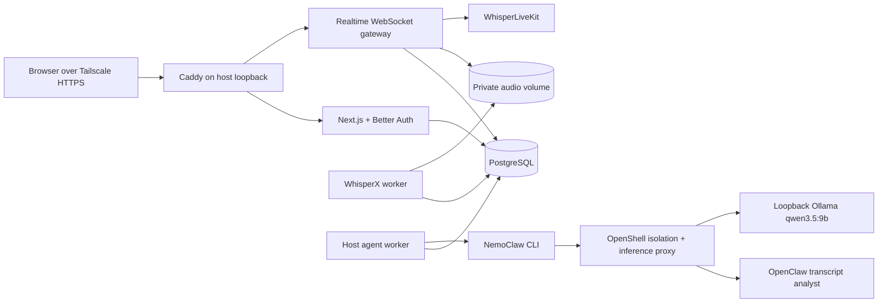

# Architecture

The browser sends 16 kHz mono PCM16 through an authenticated WebSocket. The
gateway forwards the same frames to WhisperLiveKit and commits five-second
chunks to the private audio volume. A live-ASR failure degrades captions only;
recording continues.

Stop is idempotent. The gateway verifies chunk order, runs `ffmpeg` to produce
FLAC, records a SHA-256 checksum, and queues WhisperX. WhisperX owns the final
transcript and atomically replaces provisional content. The finalizer and
agent worker share one PostgreSQL advisory lock, and both defer while a
recording is live.

The host-side agent worker is deliberately outside Compose. It leases only
analysis jobs, uploads only the selected timestamped transcript into a
per-analysis OpenClaw workspace, and invokes a dedicated read-only
`transcript-analyst` through the NemoClaw JSON surface. OpenShell owns
credentials, policy, and the authenticated Ollama proxy.

## Trust boundaries

- Caddy is the only published container port and binds to `127.0.0.1`.
- WhisperLiveKit and WhisperX alone join an un-published egress network to
  hydrate the shared model cache; application, database, and realtime traffic
  remains on the Docker-internal network.
- Tailscale Serve is the only remote ingress and terminates HTTPS.
- Session cookies are checked before WebSocket upgrade and every owner-scoped
  database lookup.
- Audio paths are generated server-side from opaque IDs and never accepted
  from a request.
- OpenClaw has no database credentials, Docker socket, messaging channel, web
  search, or external MCP integration.
- Transcript content is data, never part of the agent's instruction channel.
